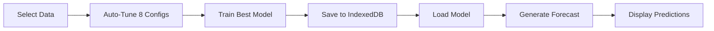

# 🚀 Quick Start Guide - ML Forecasting System

## ⚡ 3-Minute Setup

### 1️⃣ Start the Server (if not running)
```bash
npm run dev
```
Navigate to: `http://localhost:5173`

### 2️⃣ Train Your First Model
1. Click **"ML Training"** in sidebar
2. Select: **Destination** → **United States**
3. Click: **"Start Training with Auto-Tuning"**
4. Wait 2-3 minutes ⏱️
5. ✅ Model saved automatically!

### 3️⃣ Generate Your First Forecast
1. Click **"ML Forecast"** in sidebar
2. Select: **Destination** → **United States**
3. Click: **"Load Model"**
4. Click: **"Generate Forecast"**
5. 🎉 View predictions on chart!

---

## 📍 Where Are My Models Stored?

### Browser Storage (100% FREE!)
- **IndexedDB** → Model files (TensorFlow.js)
- **localStorage** → Model metadata (metrics, config)

### Check Storage
Press `F12` in browser → Application tab → IndexedDB

---

## 🎯 Key Pages

| Page | URL | Purpose |
|------|-----|---------|
| **ML Training** | `/train` | Train models with auto-tuning |
| **ML Forecast** | `/forecast` | Generate predictions |
| **Dashboard** | `/` | View all visualizations |

---

## 📊 What You Get

### Training Page (`/train`)
- ✅ Automatic hyperparameter tuning (8 configs)
- ✅ Real-time progress tracking
- ✅ Best model auto-selected
- ✅ Full metrics display (Accuracy, R², MAE, RMSE, MAPE)
- ✅ Model management (view/delete)

### Forecast Page (`/forecast`)
- ✅ Load pre-trained models
- ✅ No user inputs needed
- ✅ 5 or 10 year predictions
- ✅ Interactive chart
- ✅ Model metrics display

---

## 💾 Storage Information

### Capacity
- **Chrome/Edge:** ~60% of disk space
- **Firefox:** ~50% of disk space
- **Safari:** 1 GB

### Typical Usage
- **1 Model:** ~500 KB - 2 MB
- **50-100 Models:** Typical capacity

### Management
- Keep 3-5 best models per dataset
- Delete old/underperforming models
- No cloud costs! 💰

---

## 🎓 How It Works



1. **Training:** Tests 8 different neural network configurations
2. **Selection:** Picks model with highest accuracy
3. **Storage:** Saves to browser (IndexedDB + localStorage)
4. **Forecasting:** Loads model and generates predictions
5. **Visualization:** Shows historical + predicted data

---

## 📈 Example Metrics

Good model:
- ✅ **Accuracy:** 85%+
- ✅ **R²:** 0.90+
- ✅ **MAPE:** <15%

Okay model:
- ⚠️ **Accuracy:** 70-85%
- ⚠️ **R²:** 0.70-0.90
- ⚠️ **MAPE:** 15-25%

Poor model (retrain):
- ❌ **Accuracy:** <70%
- ❌ **R²:** <0.70
- ❌ **MAPE:** >25%

---

## 🔧 Troubleshooting

### "No models available"
→ Go to `/train` and train a model first

### "Quota exceeded"
→ Delete old models in training page

### Training stuck?
→ Normal! Takes 2-5 minutes for 8 configs

### Predictions are 0?
→ May need more/better training data

---

## 🎉 That's It!

You now have a fully functional ML forecasting system with:
- ✅ Automatic hyperparameter tuning
- ✅ Free local storage (IndexedDB)
- ✅ Separate training/forecasting pages
- ✅ Up to 10-year predictions
- ✅ No retraining needed for forecasts

**Ready to forecast! 🚀**

---

## 📚 More Information

- **ML_SYSTEM_COMPLETE.md** - Full documentation
- **LOCAL_STORAGE_GUIDE.md** - Storage details
- **RBAC_RECOMMENDATIONS.md** - Security setup

---

## 🆘 Need Help?

1. Open browser console (`F12`)
2. Check for error messages
3. Verify data is loaded (Dashboard page)
4. Try training with different dataset
5. Clear browser cache and retry

